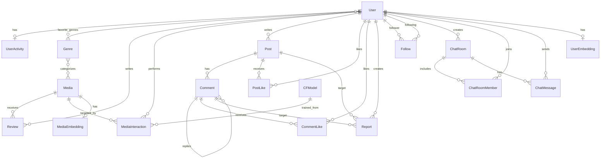

*This project has been created as part of the 42 curriculum by llarrey, jihyeki2, seong-ki, thelee, jaoh.*

# ft_transcendence Surprise - Media Platform

## Description

**ft_transcendence Surprise - Media Platform** is a web service for discovering movies, anime, and dramas, receiving personalized recommendations, writing reviews, and discussing media with other users.

The goal of this project is to satisfy the 42 `ft_transcendence` Surprise requirements by building a full-stack service that goes beyond a simple game or chat application. It includes authentication, real-time communication, community features, recommendation systems, RAG-based search, and operational tooling.

Key features:

- Registration, login, JWT authentication, and profile management
- User onboarding for favorite genres and countries
- Movie, anime, and drama list/detail/search/random/trending views
- Review creation, update, deletion, and star ratings
- Media interactions such as like, dislike, watchlist, and watched
- Recommendation API combining collaborative filtering, content-based filtering, and pgvector search
- Natural-language RAG recommendation using Gemini API and pgvector
- Community posts, comments, replies, likes, and reports
- Real-time discussion-room chat using Django Channels and Redis
- UI internationalization in Korean, English, and French
- Report handling, user moderation, health checks, and PostgreSQL backup/restore scripts

## Team Information

| 42 login | Name | Role(s) | Responsibilities |
| --- | --- | --- | --- |
| `llarrey` | Lucas Larrey | PO / Backend Developer | Product requirements, backend API design, authentication/user/chat domains, backend quality |
| `jihyeki2` | Jihye Kim | PM / Frontend Developer | Schedule and task coordination, frontend pages, user flows, UI integration |
| `seong-ki` | Seonghyeon Kim | Tech Lead / Architect / Data / DevOps | System architecture, Docker/DB/Redis setup, data loading, CI/CD, backup and recovery |
| `thelee` | Thea Lee | AI Developer | Recommendation system, embeddings, RAG search, AI data pipeline |
| `jaoh` | Jaeone Oh | Frontend Developer | Frontend components, community/media/chat UI, responsive screens |

## Project Management

The team split work by feature area. Backend, frontend, AI, and DevOps owners coordinated API contracts and UI requirements before integration.

- Workflow: feature branches, Pull Request review, merge into `dev`, then stabilize before merging into `main`
- Branch strategy: `feature/<name>`, `fix/<name>`, `test/<name>`, `docs/<name>`
- Meetings: requirement analysis, API contract checks, progress syncs, pre-integration bug reviews
- Project management tools: GitHub Issues/Projects, GitHub Pull Requests, GitHub Actions
- Communication channels: Discord for meetings, PR notifications, and asynchronous questions
- Quality control: backend lint/test, frontend lint, Docker image build checks, PR reviews

## Technical Stack

| Area | Technology | Reason |
| --- | --- | --- |
| Frontend | React 19, TypeScript, Vite, Redux Toolkit, RTK Query, React Router, Tailwind CSS | SPA development, type safety, fast dev server, API caching/state management, component-based UI |
| Backend | Python 3.12, Django 4.2, Django REST Framework, Simple JWT, Daphne | Fast API development, ORM data modeling, JWT authentication, ASGI runtime |
| Realtime | Django Channels, channels-redis, WebSocket, Redis | Asynchronous messaging for real-time discussion rooms and user activity |
| Database | PostgreSQL 16, pgvector | Relational integrity, complex queries, and vector similarity search in one database |
| Cache / Queue | Redis, Celery | Recommendation score caching, async embedding/model tasks, health checks |
| AI / ML | Gemini API, pgvector, scikit-surprise, hnswlib, numpy, pandas, tiktoken | Natural-language recommendation, vector embeddings, collaborative filtering, search performance |
| DevOps | Docker, Docker Compose, GitHub Actions, Makefile | Reproducible local environment, command automation, CI build/validation |
| Data Source | TMDB API, AniList API, Django management commands | Normalize and load movie, drama, and anime metadata from external APIs |

The main technical choices were based on implementation speed, team learning cost, reproducibility in the 42 evaluation environment, and extensibility for both real-time and AI recommendation features.

## Database Schema



| Table / Model | Key fields | Description |
| --- | --- | --- |
| `users.User` | `id`, `username`, `email`, `password`, `avatar_url`, `bio`, `favorite_genres`, `favorite_countries`, `onboarding_completed`, `is_banned` | Extended Django `AbstractUser` model |
| `users.UserActivity` | `user`, `is_online`, `last_seen`, `current_chat_room` | User presence and current chat room |
| `media.Genre` | `id`, `name` | Genre master data |
| `media.Media` | `title`, `media_type`, `genres`, `country`, `description`, `release_date`, `image_url`, `avg_rating`, `rating_count`, `external_source`, `external_id` | Movie/anime/drama metadata |
| `media.Review` | `user`, `media`, `rating`, `content`, `images`, `visibility`, `created_at`, `updated_at` | User review; one review per user/media pair |
| `media.MediaInteraction` | `user`, `media`, `action`, `created_at` | Like/dislike/watchlist/watched interactions used for recommendations |
| `community.Post` | `user`, `title`, `content`, `media_files`, `like_count`, `report_count`, `view_count`, `is_hidden` | Community post |
| `community.Comment` | `post`, `user`, `parent_comment`, `content`, `media_files`, `like_count`, `report_count`, `is_hidden` | Comments and replies |
| `community.PostLike` | `user`, `post`, `created_at` | Post likes, limited to one per user/post |
| `community.CommentLike` | `user`, `comment`, `created_at` | Comment likes, limited to one per user/comment |
| `community.Report` | `user`, `report_type`, `reason`, `status`, `post`, `comment`, `processed_by`, `processed_at` | Post/comment reports, constrained to exactly one target |
| `community.Follow` | `follower`, `following`, `created_at` | User follow relationship, with self-follow prevented |
| `community.TrendingPost` | `post`, `score`, `calculated_at` | Cached trending-post calculation result |
| `chat.ChatRoom` | `title`, `description`, `created_by`, `password`, `max_members`, `is_active`, `created_at`, `ended_at` | Real-time discussion room |
| `chat.ChatRoomMember` | `room`, `user`, `role`, `joined_at` | Chat-room membership and role |
| `chat.ChatMessage` | `room`, `user`, `content`, `message_type`, `created_at` | Persisted chat message |
| `ai.UserEmbedding` | `user`, `embedding`, `source_media_count`, `updated_at` | User preference vector |
| `ai.MediaEmbedding` | `media`, `embedding`, `source_text`, `updated_at` | Media vector for search, using an HNSW cosine index |
| `ai.CFModel` | `version`, `model_data`, `user_count`, `item_count`, `rating_count`, `latent_dim`, `created_at` | Stored collaborative-filtering SVD model |

## Features List

| Feature | Member(s) | Description |
| --- | --- | --- |
| Authentication and sessions | `llarrey`, `jihyeki2` | Registration, login, logout, JWT issue/refresh, password change |
| User profiles | `llarrey`, `jihyeki2`, `jaoh` | Profile read/update, avatar URL, bio, onboarding preferences |
| Follow and activity status | `llarrey`, `seong-ki` | Follower/following relationships, online status, last-seen data |
| Media discovery | `seong-ki`, `jihyeki2`, `jaoh` | Media list, detail, search, random, and trending views |
| Review system | `llarrey`, `jihyeki2`, `jaoh` | Star-rating reviews with create/update/delete and visibility control |
| Media interactions | `thelee`, `llarrey`, `jaoh` | Like, dislike, watchlist, and watched signals used for recommendations |
| Personalized recommendations | `thelee`, `seong-ki` | Hybrid recommendation API combining collaborative and content-based filtering |
| RAG recommendations | `thelee` | Natural-language query analysis and pgvector similarity search for media recommendations |
| Community board | `llarrey`, `jaoh`, `jihyeki2` | Post CRUD, search/sort flow, comments/replies, likes |
| Reports and moderation | `llarrey`, `jihyeki2` | Post/comment reports, report handling, user bans |
| Real-time chat | `llarrey`, `seong-ki`, `jaoh` | WebSocket discussion rooms, join/leave events, message persistence, connection limits |
| Internationalization | `jihyeki2`, `jaoh` | Korean, English, and French translation files with language switching |
| Health checks | `seong-ki` | `/health/live/` and `/health/` checks for Django, PostgreSQL, Redis, and Celery |
| Backup and recovery | `seong-ki` | PostgreSQL backup and restore scripts using `pg_dump` and `pg_restore` |
| CI/CD | `seong-ki` | GitHub Actions for backend lint/test, frontend lint, and Docker build checks |

## Modules

Scoring rule: Major module = 2 points, Minor module = 1 point.

| Type | Module | Points | Reason for choosing it | Implementation | Member(s) |
| --- | --- | ---: | --- | --- | --- |
| Major | Frontend + Backend Framework | 2 | Provides a clear API-driven SPA architecture | React/TypeScript/Vite frontend with a Django REST Framework backend | `jihyeki2`, `jaoh`, `llarrey` |
| Major | Real-time Features | 2 | Enables immediate user-to-user interaction | Django Channels, Redis channel layer, WebSocket chat rooms | `llarrey`, `seong-ki`, `jaoh` |
| Major | User Interaction | 2 | Core relationship and community behavior for the service | Profiles, reviews, follows, likes, reports, chat | `llarrey`, `jihyeki2`, `jaoh` |
| Major | Public API | 2 | Separates frontend/backend concerns and supports extensibility | REST API under `/api/auth`, `/api/users`, `/api/media`, `/api/community`, `/api/chat`, `/api/ai` | `llarrey`, `seong-ki` |
| Major | Standard User Management & Authentication | 2 | Provides access control and the foundation for personalization | Django custom user, Simple JWT, refresh token blacklist, password change | `llarrey`, `jihyeki2` |
| Major | Recommendation System | 2 | Provides a personalized experience aligned with the Surprise topic | SVD-based CF, user/media embedding CBF, Redis caching, Celery tasks | `thelee`, `seong-ki` |
| Major | RAG System | 2 | Enables natural-language media discovery | Gemini query parsing/embedding, pgvector cosine search, RAG recommendation endpoint | `thelee` |
| Minor | ORM | 1 | Improves data integrity and development productivity | Django ORM relationships, constraints, indexes, migrations | `llarrey`, `seong-ki`, `thelee` |
| Minor | Custom Design System | 1 | Keeps the UI consistent and reusable | Shared components such as Button, TextField, TextArea, StatusMessage, EmptyState, SectionCard | `jihyeki2`, `jaoh` |
| Minor | Advanced Search | 1 | Improves media and community discoverability | Media search API, post search/sort flow, genre/type-based browsing | `llarrey`, `seong-ki`, `jaoh` |
| Minor | Multiple Languages | 1 | Improves accessibility for international evaluators and users | `ko`, `en`, `fr` locale JSON files and language switcher UI | `jihyeki2`, `jaoh` |
| Minor | Health Check & Backup | 1 | Improves operational stability and recoverability | `/health/`, `/health/live/`, Redis/Celery/DB checks, backup/restore scripts | `seong-ki` |

Total: 7 Major modules x 2 points = 14 points, 5 Minor modules x 1 point = 5 points, for a total of 19 points. The officially recognized score may vary depending on the subject rules and bonus cap.

## Individual Contributions

### `llarrey` - Lucas Larrey

- Designed and implemented the Django/DRF backend API structure
- Implemented JWT authentication, registration, login, logout, and password change
- Implemented user profile, follow, report, and user-ban related APIs
- Implemented Django Channels chat models and WebSocket consumer
- Built core domain constraints, serializers, and views

The main challenge was aligning REST API authentication and WebSocket authentication around the same user model. Redis is used both as the channel layer and as a connection-status store, while chat-room members and messages are persisted in the database for reconnection and moderation workflows.

### `jihyeki2` - Jihye Kim

- Managed project schedule, task distribution, and PR integration flow
- Implemented user-facing screens such as login, signup, onboarding, profile, and my page
- Organized API integration and authentication state with RTK Query
- Applied multilingual UI support and reviewed user flows
- Integrated frontend views for admin/report handling flows

The main challenge was keeping screens stable while backend response formats evolved during development. Response normalization helpers and TypeScript types were added so UI components could receive predictable data shapes.

### `seong-ki` - Seonghyeon Kim

- Designed overall architecture and configured Docker Compose, PostgreSQL, Redis, and Celery
- Implemented media data loading commands and TMDB/AniList normalization flow
- Configured PostgreSQL pgvector, indexes, and backup/restore scripts
- Set up GitHub Actions CI/CD, Docker build checks, and Discord PR notifications
- Organized health-check endpoints and operational documentation

The main challenge was making Django, Redis, Celery, pgvector, and the frontend dev server reproducible in one Docker Compose environment. A Makefile reduces repeated commands, and health checks plus `depends_on` conditions stabilize service startup.

### `thelee` - Thea Lee

- Designed and implemented the recommendation-system domain
- Implemented media embedding generation, user embedding generation, and CBF scoring
- Implemented SVD-based CF model storage and score-caching flow
- Implemented hybrid recommendation score calculation
- Implemented RAG recommendation flow using Gemini API and pgvector

The main challenge was handling the cold-start problem and recommendation-computation cost. The system falls back to popular/random candidates when user activity is insufficient, then gradually combines CBF and CF weights as more interaction data becomes available.

### `jaoh` - Jaeone Oh

- Implemented frontend screens for media discovery, media detail, community, and chat
- Improved shared UI components and visual consistency
- Implemented post/comment/like/report UI flows
- Improved responsive layout and user input forms
- Added types and state handling needed during backend API integration

The main challenge was handling loading, empty, and error states consistently in state-heavy screens such as community and chat. Shared status components were used to reduce repeated UI and make screen-specific exceptions clearer.

## Instructions

### Prerequisites

Required tools:

- Docker Desktop or Docker Engine
- Docker Compose v2
- GNU Make
- Git

Additional tools for direct local execution:

- Python 3.12
- Node.js 20
- npm
- PostgreSQL 16 + pgvector
- Redis 7

Required environment variables:

| Variable | Description |
| --- | --- |
| `SECRET_KEY` | Django secret key |
| `DEBUG` | Use `True` in development |
| `ALLOWED_HOSTS` | Example: `localhost,127.0.0.1` |
| `POSTGRES_DB` | PostgreSQL database name |
| `POSTGRES_USER` | PostgreSQL user |
| `POSTGRES_PASSWORD` | PostgreSQL password |
| `POSTGRES_HOST` | Use `db` with Docker Compose |
| `POSTGRES_PORT` | Default: `5432` |
| `REDIS_URL` | Use `redis` or `redis://redis:6379/0` with Docker Compose |
| `VITE_API_BASE_URL` | Example: `http://localhost:8000/api` |
| `GEMINI_API_KEY` | Required for AI embedding/RAG recommendations |
| `TMDB_API_KEY` | Required for movie/drama data loading |
| `ANILIST_API_KEY` | Required for anime data loading |
| `GOOGLE_CLIENT_ID` | Used for OAuth extension or Google authentication setup |

### Run With Docker Compose

1. Clone the repository.

```bash
git clone git@github.com:Shyeon102/Transcendence.git
cd Transcendence
```

2. Prepare the environment file.

```bash
cp .env.example .env
```

3. Fill `.env` for your local environment. Minimal example:

```env
SECRET_KEY=local-secret-key
DEBUG=True
ALLOWED_HOSTS=localhost,127.0.0.1
POSTGRES_DB=transcendence
POSTGRES_USER=transcendence
POSTGRES_PASSWORD=transcendence
POSTGRES_HOST=db
POSTGRES_PORT=5432
REDIS_URL=redis
VITE_API_BASE_URL=http://localhost:8000/api
GEMINI_API_KEY=
TMDB_API_KEY=
ANILIST_API_KEY=
GOOGLE_CLIENT_ID=
```

4. Build and start the services.

```bash
make up
```

`make up` runs the following steps:

- Build and start Docker Compose services in the background
- Run Django migrations
- Run the external media data loading command

5. Open the service in a browser.

```text
Frontend: http://localhost:5173
Backend API: http://localhost:8000
Health check: http://localhost:8000/health/
```

### Useful Commands

```bash
make logs
make migrate
make load_media
make media_embedding
make backup
make restore FILE=backups/postgres_YYYYmmdd_HHMMSS.dump
make stop
make fclean
```

### Direct Local Execution

Backend:

```bash
cd backend
python -m venv .venv
source .venv/bin/activate
pip install -r requirements.txt
python manage.py migrate
python manage.py load_media
daphne -b 0.0.0.0 -p 8000 project.asgi:application
```

Frontend:

```bash
cd frontend
npm ci
npm run dev
```

Celery worker and beat, if needed:

```bash
cd backend
celery -A project worker --loglevel=info
celery -A project beat --loglevel=info
```

### Main API Routes

| Route | Description |
| --- | --- |
| `/api/auth/` | Registration, login, logout, token refresh, password change |
| `/api/users/` | Profile, onboarding, follow, activity status, user moderation |
| `/api/media/` | Media list, detail, search, random, trending, reviews, interactions |
| `/api/community/` | Posts, comments, likes, reports |
| `/api/chat/` | Chat-room REST API |
| `/ws/chat/<room_id>/` | Real-time chat WebSocket |
| `/api/ai/recommend/<user_id>/` | Personalized recommendation |
| `/api/ai/rag/` | Natural-language RAG recommendation |
| `/health/live/` | Process liveness |
| `/health/` | PostgreSQL, Redis, and Celery status |

## Resources

### Project References

- 42 ft_transcendence subject: official project requirements
- Django documentation: https://docs.djangoproject.com/
- Django REST Framework documentation: https://www.django-rest-framework.org/
- Django Channels documentation: https://channels.readthedocs.io/
- Simple JWT documentation: https://django-rest-framework-simplejwt.readthedocs.io/
- PostgreSQL documentation: https://www.postgresql.org/docs/
- pgvector documentation: https://github.com/pgvector/pgvector
- Redis documentation: https://redis.io/docs/
- Celery documentation: https://docs.celeryq.dev/
- React documentation: https://react.dev/
- Redux Toolkit documentation: https://redux-toolkit.js.org/
- Vite documentation: https://vite.dev/
- Docker documentation: https://docs.docker.com/
- TMDB API documentation: https://developer.themoviedb.org/docs
- AniList GraphQL API documentation: https://docs.anilist.co/
- Google Gemini API documentation: https://ai.google.dev/gemini-api/docs
- Surprise recommender systems library: https://surpriselib.com/

### AI Usage During Development

Development-assistant AI was used for:

- Drafting and structuring the README, architecture notes, and module description documents
- Assisting with error analysis for Django/DRF, React/TypeScript, and Docker Compose configuration
- Brainstorming recommendation-system, embedding, and RAG pipeline design
- Drafting test commands, debugging procedures, and code-review checklists
- Summarizing long error logs and documentation for team discussions

AI-generated content was not merged directly without review. Team members checked and adapted it against the project requirements and actual code. Areas that directly affect service behavior, such as authentication, database migrations, recommendation output, and backup/restore procedures, were reviewed through local execution and code review.

As a product feature, AI is used through Gemini API, pgvector, Django, and Celery for media embedding generation, natural-language query parsing, vector similarity search, and hybrid recommendations.

## Known Limitations

- Without external API keys, media data loading and parts of the AI/RAG recommendation flow are limited.
- Recommendation quality improves as user reviews and interaction data accumulate.
- The project is written around the Docker Compose development environment. Production deployment requires stronger secret management, HTTPS, CORS, `ALLOWED_HOSTS`, and static/media storage configuration.
- The OAuth flow has frontend configuration and callback routing prepared, but real provider integration requires deployment-specific client id/secret and redirect URI settings.

## License / Credits

This project was created for learning and evaluation as part of the 42 curriculum. When using external data and APIs, follow the terms of service of providers such as TMDB, AniList, and Google Gemini.
